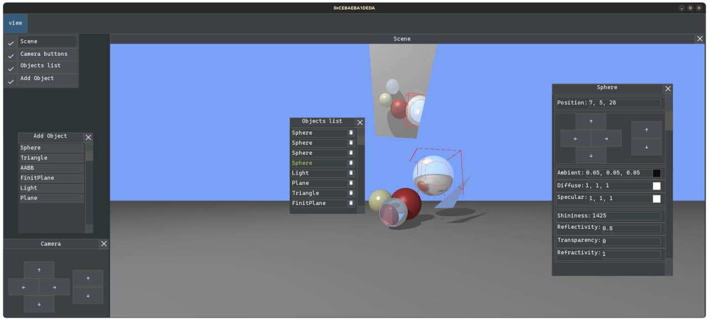
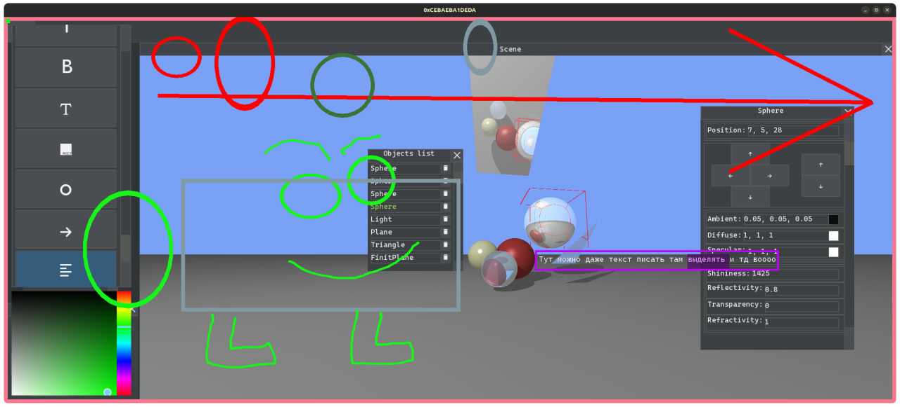

---
author:
- Попов Владимир Сергеевич, Б01-411, 2 курс ИВТ ФРКТ МФТИ
title: |
  Написание оптического конструктора и плагинов дорисовки
---


# Optor - оптический конструктор

Реализация рейтрейсинга геометрических примитивов. Разработка оконного менеджера для модификации объектов сцены. Реализация общего интерфейса плагинов для бэкенда визуализации и дорисовки.

## Зависимости

| Зависимость           | Минимальная версия    | Назначение                                    |
|-----------------------|-----------------------|-----------------------------------------------|
| **СMake**             | 3.21                  | Сборка проекта и зависимостей                 |
| **g++**               | 11.4                  | Компиляция C++20 кода                         |
| **сигареты**          | 3.0.1                 | Импотенция                                    |

SFML и SDL не требуются, так как плагины уже поставляют с собой графические бибилиотеки используемые в реализации.

## Использование

### Установка

```bash
$ git clone https://github.com/kzueirf12345/optor.git
$ cd optor
$ git submodule update --init --recursive
$ cmake -B build -DCMAKE_BUILD_TYPE=RelWithDebInfo
$ cmake --build build -j$(nproc)
$ ./build/optor # если есть ошибки из-за старой версии ld можете попробовать ./run_with_glibc238.sh
```

### Функционал

<video src="readme_assets/usage.mp4"  controls></video>



Если нажать на сцену, то она захватит курсор и можно двигать камерой, ходить можно на стрелочки, либо же при помощи стрелок на панели управления камерой. Если нажать на объект, то он выделится красным параллелепипедом.

Есть окно со списком объектов сцены, и можно удалять на корзинку. Чтобы открыть панель изменения свойств объекта нажмите ```E```. В ней можно менять цвет, параметры материала (прозрачность, отражение, блики, поглощение) и двигать его. Чтобы принять изменения нажмите ```Enter```.

Для добавления объекта нажмите на соответствующий тип в окне добавления. Он появиться на нулевых координатах и вы сможете отредактировать его под свои нужды.

Перемещать окна можно либо держа ЛКМ за топбар, либо на среднюю кнопку мыши в любом месте. Чтобы скрыть окно, можно нажать на крестик, либо же использовать чек-боксы view на панели инструментов.

#### Дорисовка



Чтобы открыть режим дорисовки нажмите ```~```

Слева находятся иконки инструментов дорисовки из разных плагинов. Там есть кружки, стрелочки, прямоугольнички, текстики, палочки, рисовалочка, даже изображеньки (но они работают не очень).

Самая последняя иконка это моё текстовое поле, я им горжусь, поэтому далее опишу всё что оно умеет

Комбинация клавиш | Назначение
---- | ----
double click ЛКМ | Выделает слово
Зажать ЛКМ и водить мышкой | Выделить 
Backspace | Стереть букву слева или выделенную часть
Ctrl + Backspace | Стереть слово слева
Delete | Стереть букву справа или выделенную часть
Ctrl + Delete | Стереть слово справа
Ctrl + C | Скорпировать выделенное в системный буфер обмена
Ctrl + V | Вставить из системного буфера обмена (Если что-то выделено, то заменится)
Ctrl + X | Вырезать выделенное в системный буфера обмена
Ctrl + A | Выделить всю строку
Ctrl + &larr; / &rarr; | Перепрыгнуть курсором через слово 
Ctrl + Shift + &larr; / &rarr; | Перепрыгнуть курсором через слово и выделить его
Home | Переместиться в начало строки
Shift + Home | Переместиться в начало строки и выделить
End | Переместиться в конец строки
Shift + End | Переместиться в конец строки и выделить

## Детали реализации

### Плагины

Каждый плагин должен наследоваться от следующего базового класса из общего интерфейса и реализовывать соответствущие методы.

<details>
<summary>Нажмите, чтобы увидеть код</summary>

```cpp
#define CREATE_PLUGIN_FUNC_NAME CreatePlugin
static inline const std::string CreatePluginFuncNameStr = "CreatePlugin";

class Manager;

/**
 * @brief A plugin, loaded by Manager.
 *
 * All plugins which do something meaningfull should implement
 * interfaces, inherited from this. For example:
 *
 * @usage @code
 *      // in interface definition file
 *      class ColorSchemePlugin : public Plugin {
 *          virtual Color GetColor(std::string_view name) = 0;
 *      };
 *
 *      // in plugin
 *      class MyColorScheme : public ColorSchemePlugin {
 *          ...
 *      };
 *      Plugin *CreatePlugin() { return new MyColorScheme; }
 *
 *      // in app
 *      int main() {
 *          ...
 *          auto *scheme = manager.GetAnyOfType<ColorSchemePlugin>();
 *          scheme.GetColor("red");
 *      }
 * @endcode
 */
class Plugin {

    friend class Manager;

    // Those fields are initialized by manager
    // when it loads the plugin

    /** Handle returned by dlopen() */
    void *soHandle;

    /** Manager which owns the plugin */
    Manager *manager = nullptr;


protected:
    Plugin() {}

public:

    /** Unload .so */
    virtual ~Plugin() = default;

    /**
     * @brief Obtain manager who loaded this plugin.
     * Can be used in `AfterLoad()` to get vector of
     * other plugins to find dependencies.
     */
    virtual Manager *GetManager() const { return manager; }

    /**
     * @brief Get .so handle, obtained with `dlopen()`.
     * May be usefull for something hacky.
     */
    inline void *GetSOHandle() const { return soHandle; };

    /** Identifier used for naming plugin in dependencies */
    virtual std::string_view GetIdentifier() const = 0;

    /** User-readable name, to be shown in UI */
    virtual std::string_view GetName() const = 0;

    /** User-readable info about what this thing does */
    virtual std::string_view GetDescription() const = 0;

    /** Vector of plugin identifiers this plugin depends on */
    virtual std::vector<std::string_view> GetDependencies() const = 0;

    /**
     * Vector of plugins this conflicts with.
     * (so they both cannot be enabled at same time). Note what things
     * like themes do not conflict - they are both enabled, but values
     * of only one of them are used.
     * For most plugins this will be empty.
     */
    virtual std::vector<std::string_view> GetConflicts() const = 0;

    /**
     * Do some things after plugins were loaded.
     * For example, find other plugins in the list.
     */
    virtual void AfterLoad() = 0;
};
```

</details>

Также есть менеджер плагинов. которой уже реализован для удобства, но на самом деле можно использовать свой.

<details>
<summary>Нажмите, чтобы увидеть код</summary>

```cpp
/**
 * A manager is a class which loads plugins, owns them, and provides
 * them for other plugins to find their dependencies.
 *
 * Due to this being the thing loading plugins, its implementation
 * is not in a plugin.
 */
class Manager {

    // DO NOT REORDER!
    // Otherwise .so handles will be destroyed before plugins,
    // and nonexistent destructors will be called.
    std::vector<std::unique_ptr<void, int (*)(void*)>> soHandles;
    std::vector<std::unique_ptr<Plugin>> plugins;

    typedef Plugin *(*CreatePluginFn)();

public:

    /**
     * @brief Load a plugin from file.
     * If file loading fails, will throw `LoadError`.
     */
    Plugin *LoadFromFile(const std::string_view path);

    /**
     * @brief Find plugin by its identifier.
     * Will return NULL if such plugin was not found.
     */
    Plugin *GetById(std::string_view id) const;

    /**
     * @brief Get plugin which implements given interface.
     */
    template<typename Interface>
    Interface *GetAnyOfType() const;

    /**
     * @brief Get all plugins implementing given interface.
     * Creates a vector of plugins, so do not call this in a loop.
     */
    template<typename Interface>
    std::vector<Interface*> GetAllOfType() const;

    /**
     * Get all the plugins
     */
    const std::vector<std::unique_ptr<Plugin>> &GetAll() const;

    /**
     * All plugins which we want are now loaded.
     * Check dependencies, runs `AfterLoad()`.
     * If a dependency is missing, will throw `DependencyError`.
     */
    void TriggerAfterLoad();
};
```
</details>

Реализованы плагин дорисовки, а также бэкенда графической библиотеки. Для бэкенда придумана своя самостоятельная система классов, под копотом у которой может быть хоть SDL, хоть SFML, хоть OpenGL и вообще что угодно (другое не пробовали).

### Оконный менеджер

Базовый класс окна назвыается Widget требует от наследников реализации следующих методов промагации ивентов детям

```cpp
class Widget {
    Widget(const dr4::Vec2f& size, optor::WidgetsState* state);

    virtual void Draw             (dr4::Texture& srcTexture)    = 0;
    virtual void SetPosition      (const dr4::Vec2f& position)  = 0;
    
    virtual bool OnMouseMove      (const dr4::Event& event)     = 0;
    virtual bool OnMousePress     (const dr4::Event& event)     = 0;
    virtual bool OnMouseRelease   (const dr4::Event& event)     = 0;
    virtual bool OnKeyboardPress  (const dr4::Event& event)     = 0;
    virtual bool OnKeyboardRelease(const dr4::Event& event)     = 0;
    virtual bool OnTextInput      (const dr4::Event& event)     = 0;
    virtual void OnIdle           ()                            = 0;
}
```

Также каждый виджет должен поддерживать корректное состояние WidgetsState, а также может опираться на его значения

```cpp
struct WidgetsState {
    dr4::Window* window;

    const optor::Widget* hoveredWidget;
    const optor::Widget* draggedWidget;
    const optor::Widget* selectedWidget;
    dr4::Vec2f           prevMouseCoord;

    optor::OpticObj* selectedObj;

    std::deque<std::unique_ptr<optor::Widget>> modalWidgets;

    bool needUpdateScene;

    size_t objCounter;
};
```

Модальные виджеты нужны. чтобы они могли рисоваться не в рамках родительского виджета, а поверх всей программы. Они отрисосываются в самом конце, после обхода всего дерева виджетов, а события пропагируется им первым, а потом основному дереву. 

Менеджментов всего этого занимается WidgetManager. Также есть есть отдельный виджет, который отвечает за взаимодействие со сценой. И ещё много всяких виджетов для различных целей.